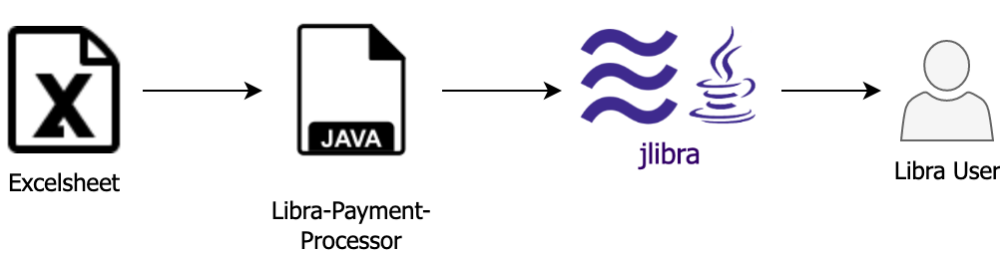

# Libra Payment Processor (Payroll Example)

In this showcase for `jlibra` and `jlibra-spring-boot-starter` data from an Excelsheet is used for payment processing instructions for Libra transactions.  
_Do not use this code in production!_



# Prerequisites

* Java 8+
* Maven
* optional: Git

# Setup

* Clone project with `git clone` or download the project as a compressed file

# Run

* Start the [java-libra-client](https://github.com/ice09/java-libra-client) with mnemonic `a cwm 'chaos crash develop error fix laptop logic machine network patch setup void'`
* Generated account 0 is Wintermute's sender account. For each hacker account, add the index to the mnemonic, eg. to create Henry's account, use `a cwm 'chaos crash develop error fix laptop logic machine network patch setup void' 1` 
* Note the account balances and sequence numbers with command `q b INDEX`, eg. `q b 1` for Henry's account
* Run the [java-payment-processor](https://github.com/ice09/libra-payment-processor/releases/tag/1.0.0)
* Note how the balances have now changed, account 0 (the sender account) has 700 Libra less, accounts 1-5 balances have increased with 100, 120, .... and the sequence numbers changed accordingly

# Build
 
* Build project with `mvn clean install`
* Change to directory target and start application with `java -jar libra-payment-processor-1.0-SNAPSHOT-jar-with-dependencies.jar`

# Usage Sample

```
    __    _ __                  ____                         ____
   / /   (_) /_  _________ _   / __ \____ ___  ___________  / / /
  / /   / / __ \/ ___/ __ `/  / /_/ / __ `/ / / / ___/ __ \/ / /
 / /___/ / /_/ / /  / /_/ /  / ____/ /_/ / /_/ / /  / /_/ / / /
/_____/_/_.___/_/   \__,_/  /_/    \__,_/\__, /_/   \____/_/_/
                                        /____/

Sending 100.0 Libra to 174d7b3e8a946a07b9746523d90c7f7fde065874c42e9c5ab0cf12c82d4559e8 (seqNo 128) OK
Sending 120.0 Libra to 16ccd2a25ebf8e1ff1c1a90ce11a93771cf05eab47900901a5a66f32e05e9053 (seqNo 129) OK
Sending 140.0 Libra to f970bf0631ee88efbd4bc6ab3449e2538551324e7bb6492b87364cf30a5ce9d5 (seqNo 130) OK
Sending 160.0 Libra to 0685fc1785a6add9434a788b3772ee6688588762c2f80128c6b2e28f0bd88d19 (seqNo 131) OK
Sending 180.0 Libra to 8c7a753da759eb345e382a919bc49f8fffe973936ea33b571aa34b5e541c6afb (seqNo 132) OK
```